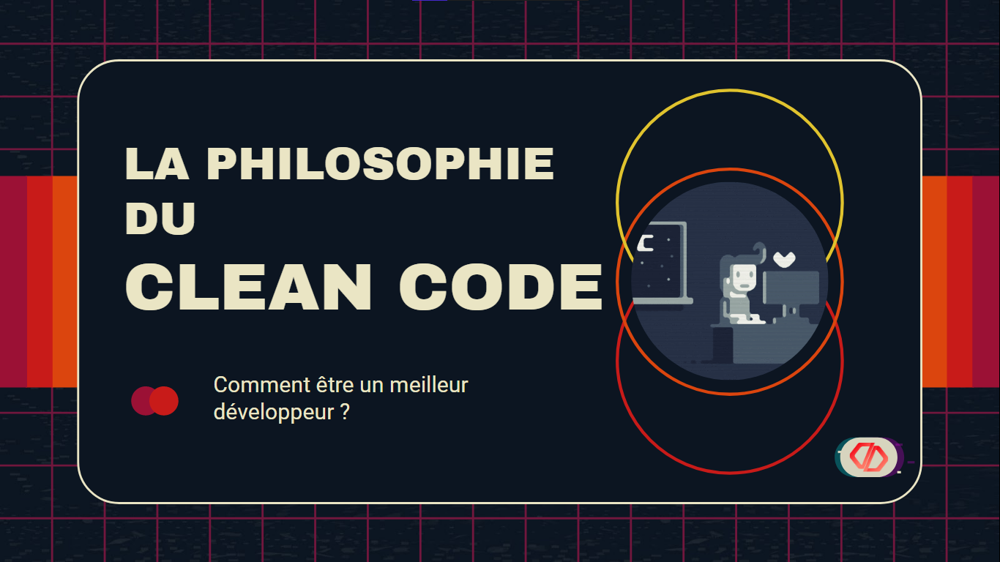

# 🎨 CLEAN-CODE CONCEPT : PRESENTATION 📚

**The CLEAN CODE CONCEPT** was a  Live Presentation with the [Galsen Dev Community](https://discord.gg/UFmp3Ztzvv).
The goal of this is to show you how a senior developer will think while programming and how they will structure their code to be as clean and well-written as possible. It was a live presentation in the **The Galsen Dev** Community [Galsen Dev](https://discord.gg/ERAUtvmY6H).
**Please Read The Slide Before**.

  

<h1 align="center">📑 USAGE 👁‍🗨</h1>

 

___
## Contributing ❤

👋🏾 Pull requests are welcome! 
___

## Issue Reporting

If you have found a bug or if you have a feature request, please report them at this repository issues section. Please do not report security vulnerabilities on the public GitHub issue tracker. The [Responsible Disclosure Program](mailto:support@orbitturner.com) details the procedure for disclosing security issues.
___

## GREETINGS
❤❤ *Coming Soon !* ❤❤

___
## Author

[Orbit Turner](https://orbitturner.com)

___
## License

This project is licensed under the MIT license. See the [LICENSE](LICENSE) file for more info.
______________________________________________________
**❤ MADE WITH LOVE ❤**

